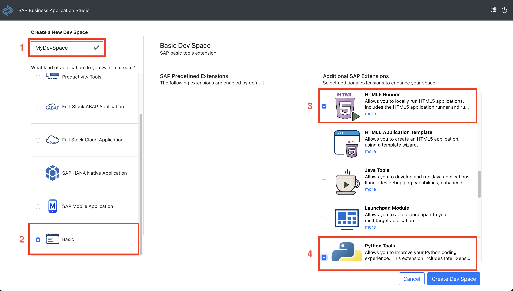
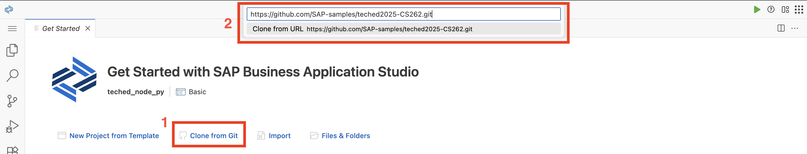
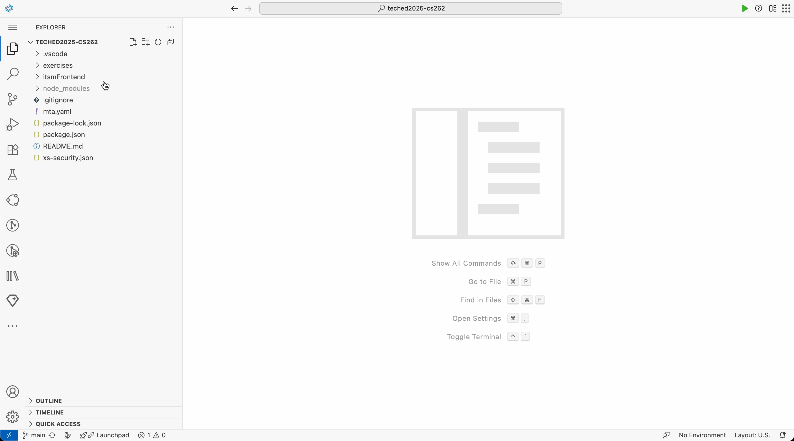

# Exercise 00 - Getting started <!-- omit in toc -->

_Estimated Time: **15 min**_

At the end of this exercise, you'll have an environment to work in for the duration of this Hands-On Workshop, and your environment will load the contents of this repository.

## Table of Contents <!-- omit in toc -->

- [Overview about the Business Scenario](#overview-about-the-business-scenario)
- [Set up your workspace and clone this repository](#set-up-your-workspace-and-clone-this-repository)
    - [Create a Dev Space in the SAP Business Application Studio](#create-a-dev-space-in-the-sap-business-application-studio)
    - [Clone this repository](#clone-this-repository)
- [Navigate to the project folder](#navigate-to-the-project-folder)
- [Install the NPM package dependencies](#install-the-npm-package-dependencies)
- [Summary](#summary)
- [Further reading](#further-reading)

## Overview about the Business Scenario

During the course of this workshop, we will use the following business scenario to illustrate how SAP Cloud ALM self-service APIs enable you to integrate SAP knowledge in your support process.

> [!NOTE]
> You are part of the *IT department* at Company ACME Inc., responsible for ensuring smooth operations across the company’s IT landscape.
> 
> ACME Inc. uses *several SAP software products* to run critical business processes.
> 
> Currently, your team manages SAP software-related support requests in *your own ticketing system*, which might lead to:
> - SAP knowledge not being directly accessible in your ITSM system.
> - Intelligent AI support-related (known from SAP for Me and Built-In Support) recommendations not available as part of your support process.
> - Increased demand for accelerated self-service in your internal support process.
> 
> Your team is therefore tasked with integrating the **SAP Cloud ALM APIs** into your company’s ITSM application so that:
> - You **integrate SAP knowledge** at an early stage into your business support process.
> - **Up-to-date AI-powered recommendations** from SAP are retrieved automatically and displayed directly in your environment.

## Set up your workspace and clone this repository

To prepare the building blocks for this workshop, you'll need to clone this repository and make its contents available in the workspace. Your workspace will be a Dev Space in the SAP Business Application Studio.

#### Create a Dev Space in the SAP Business Application Studio

:point_right: Access the SAP Business Application Studio via:
```text
https://cs262-xa6ax9xc.eu10cf.applicationstudio.cloud.sap/index.html
```

> [!IMPORTANT]
> Sign in with **tdct3ched1.accounts.ondemand.com** identity provider.

:point_right: In SAP Business Application Studio, create a new Dev Space, choosing the **Basic** type, ensure to select **HTML5 Runner** and **Python Tools**.



#### Clone this repository

:point_right: If the Dev Space is started and you're in it, use the **Clone from Git** option in the **Get Started** screen that appears to clone this repository. Follow the subsequent prompts to open the cloned repository; specify `https://github.com/SAP-samples/teched2025-CS262.git` as the URL.



Your Dev Space will reload after the repository is cloned.

## Navigate to the project folder

To work through the exercises make sure you are in the project folder at `/home/user/projects/teched2025-CS262/itsmFrontend/`.

:point_right: Open a new terminal at the `teched2025-CS262/itsmFrontend/` directory.



## Install the NPM package dependencies

You'll work primarily within the `itsmFrontend` directory of this repo, which contains a [React](https://react.dev/) project with code already written to provide UI and some of the service functionalities to make the workshop experience more accessible. The `package.json` file contains runtime and design-time dependencies.

:point_right: Install the dependencies via the terminal with:

```bash
npm install
```

:point_right: You can then double-check what's installed with:
```bash
npm list
```

The output should show you something similar to this:
```text
app@0.1.0 /home/user/projects/teched2025-CS262/itsmFrontend
├── @microsoft/fetch-event-source@2.0.1
├── @vitejs/plugin-react@4.7.0
├── autoprefixer@10.4.21
├── bestzip@2.2.1
├── copyfiles@2.4.1
├── postcss@8.5.6
├── react-dom@18.3.1
├── react-router-dom@6.30.1
├── react@18.3.1
├── tailwindcss@3.4.17
├── vite@5.4.19
└── web-vitals@1.1.2
```

## Summary

At this point, you have an environment set up to work through the remaining exercises in this workshop.

## Further reading

* [Cloning repositories](https://help.sap.com/docs/SAP%20Business%20Application%20Studio/9d1db9835307451daa8c930fbd9ab264/7a68bfa7111b44f6b1e78b51e803238c.html) in SAP Business Application Studio

---

[Next exercise](../ex1/README.md)
