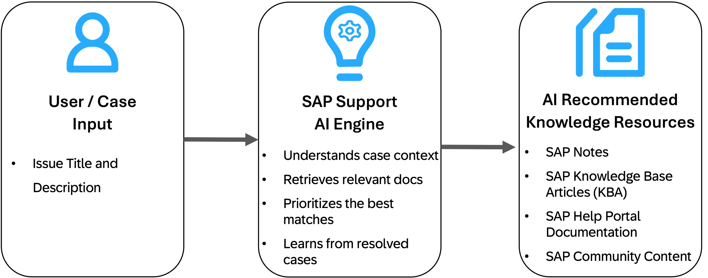
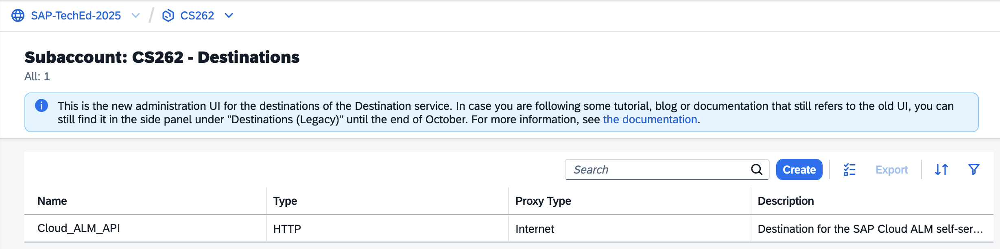
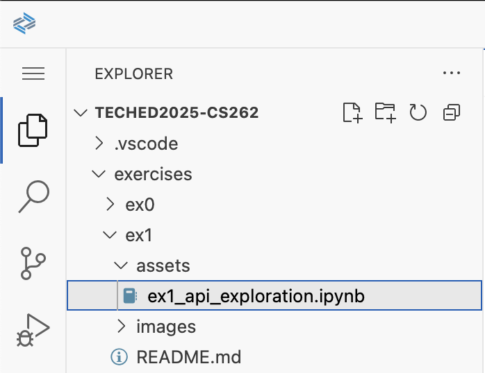
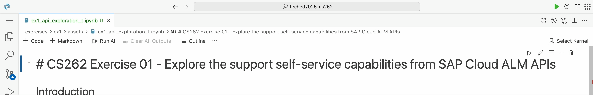

# Exercise 01 - Explore the support self-service capabilities via SAP Cloud ALM APIs <!-- omit in toc -->

_Estimated Time: **20 min**_

In this exercise, you'll explore the SAP Cloud ALM Solution Recommendation API in a guided Jupyter notebook and experience how an issue description can surface AI-driven SAP knowledge for faster resolution.

## Table of Contents <!-- omit in toc -->

- [:open\_book: Context: SAP Cloud ALM Support Self-Service](#open_book-context-sap-cloud-alm-support-self-service)
- [Try-out the Solution Recommendation API](#try-out-the-solution-recommendation-api)
- [Summary](#summary)
- [Further reading](#further-reading)

## :open_book: Context: SAP Cloud ALM Support Self-Service
- SAP Cloud ALM Self-Service leverages AI to automatically suggest the most relevant knowledge resources when a user describes an issue.
- The system analyzes the described problem, then uses semantic search and ranking models to identify and prioritize useful content from SAP's extensive knowledge base.

#### Key Features  <!-- omit in toc -->
:robot: **AI-driven relevance**: Uses state-of-the-art AI technology to deliver the latest SAP knowledge content to users.

:globe_with_meridians: **Comprehensive coverage**: Recommends across SAP Notes, Knowledge Base Articles (KBA), Help Portal guides, and SAP Community content.

:zap: **Faster resolution**: Empowers users to independently resolve issues anytime, with 24/7 availability.

:repeat: **Continuous learning**: Improves recommendations over time by learning from resolved tickets and user interactions.

## Try-out the Solution Recommendation API

The Solution Recommendation self-service capability that has been introduced above is accessible via the following Cloud ALM API:

- **Endpoint:** `/http/supportcases/recommendations/solutions`
- **Method:** `POST`
- **Required input fields:**
  - One of `subject` or `description`
- **Response:** List of SAP knowledge document recommendations

> [!TIP]
> For more details, please refer to the Cloud ALM API [documentation](https://help.sap.com/docs/cloud-alm/apis/itsm-api?locale=en-US) and [API reference](https://api.sap.com/api/CALM_ITSM/path/postSelfServiceSolutions).

:point_right: For the purpose of this workshop, we have already setup the Cloud ALM APIs within the BTP subaccount. These are accesible to you via the BTP destination named **Cloud_ALM_API**.

:point_right: To see the Solution Recommendation API in action, head over to your SAP Business Application Studio Dev Space and open the Python Jupyter notebook at `exercises/ex1/assets/ex1_api_exploration.ipynb`.

  

:point_right: Configure a Python kernel to execute the Jupyter notebook by clicking on "**Select Kernel**" in the top-right and select "**Python Environments**" > ":star: **Python 3.13.1**".

*Ignore or dismiss the prompts appearing in the bottom-right corne*r.

> [!TIP]
> To run a Jupyter notebook cell either click on the :arrow_forward: button besides the cell or press *Shift+Enter* while the cell is selected.

:point_right: After running the first two cells to install and import the required libraries, we are now going to call the API to fetch recommendations based on the given problem details. To do that provide values for the `subject` and `description` input parameters and run the third and fourth cells to perform the API call.

> [!TIP]
> To start with you can try-out the API with the following examples.
> 

> 
📝  Example 1

>  
> 
> - **Subject:** API for form launch
> - **Description:** In SuccessFactors system, we wanted to autolaunch the PM forms using CPI. So, just wanted to check if it is possible to autolaunch the form using CPI. If yes, kindly share the api for the same.
> - **Component:** LOD-DF-INT-CON
> - **Additional information:** Got error 403 when creating a form using OData API function import and seems we do not have permission to create performance review form for subject id. Got 500 error when launching forms via OData API.
> 
> :bulb: **Relevant knowledge document**: 3022523
> 

>
> 

> 
📝  Example 2

>  
> 
> - **Subject:** Not able to start on secondary node
> - **Description:** Database is not accessible on secondary node, we have tried to restart the database, but we could not, and we have observed one of the file missing datavolume_0000.dat. We have already requested the operating system team to restore the files from previous snapshots, but we are still not able to start the database.
> - **Component:** HAN-DB-ENG
> 
> :bulb: **Relevant knowledge document**: 3203165
> 

>
> 

> 
📝  Example 3

>  
> 
> - **Subject:** Job failure as IBP system seems not reachable
> - **Description:** In the last two weeks we faced two times an issue with job cancellation. The jobs have been triggered out of the IBP system. In both cases it seems the IBP production system was not reachable by the interface Cloud Integration for Data Services. In both cases the issue was temporary as the interface was working again after some point of time. The error message comes from dataflow hgr_stock_quality.
> - **Component:** LOD-HCI-DS-AGNT
> - **Additional information:** Tasks fail suddenly with error rfc_communication_failure ssslrc_conn_closed remote peer has closed the network connection when testing connection of IBP datastore SAP Cloud Integration for Data Services.
> 
> :bulb: **Relevant knowledge document**: 3428965, 3349929
> 

:point_right: To view the raw JSON response from the API, run the cell within section **"Inspect the API response"** of the Jupyter notebook.

:point_right: To better inspect a suggested SAP knowledge document along with the key fields returned run the cell in section **"Analyze a single knowledge document"**.

:point_right: **[OPTIONAL]** Experiment with your own issue descriptions and explore the suggested SAP knowledge content.

## Summary
In this exercise you used the SAP Cloud ALM Solution Recommendation API to retrieve a ranked list of SAP knowledge (Knowledge Base Articles, Notes, Help Portal, Community) based on your search parameters. You explored sample inputs in a Jupyter notebook, inspected the suggested SAP knowledge content and observed how different problem descriptions influence results.

You should now be comfortable invoking the Solution Recommendation API, interpreting its output, and preparing to build a UI that consumes these recommendations in subsequent exercises.

## Further reading

- [SAP Cloud ALM APIs - Help Portal (Documentation)](https://help.sap.com/docs/cloud-alm/apis/itsm-api?locale=en-US)

---

[Next exercise](../ex2/README.md)
