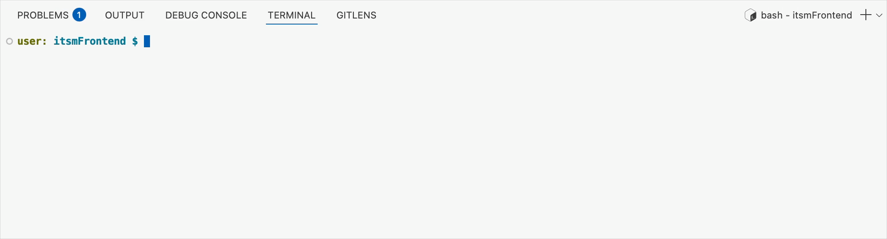
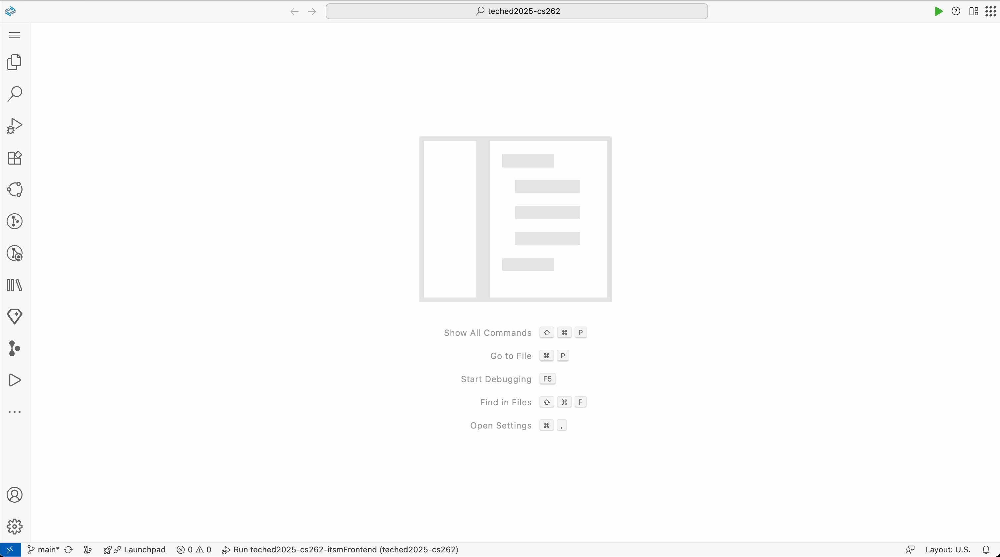

# Exercise 02 -  Integrate SAP knowledge via the SAP Cloud ALM APIs <!-- omit in toc -->

_Estimated Time: **25 min**_

In this exercise, you'll plug the SAP Cloud ALM Solution Recommendation API into the demo ITSM app to capture user issue details, call the backend, and surface ranked SAP knowledge content that let users self‑service their issues.

## Table of Contents <!-- omit in toc -->

- [Get familiar with the demo ITSM application](#get-familiar-with-the-demo-itsm-application)
- [Integrate the Self-Service Cloud ALM APIs](#integrate-the-self-service-cloud-alm-apis)
- [Summary](#summary)
- [Further reading](#further-reading)

## Get familiar with the demo ITSM application

The source code for the demo ITSM application introduced in [Exercise 00](exercises/ex0/README.md) is located in the `itsmFrontend` directory.

The source files relevant for the purpose of this workshop are:
- `src/pages/SAPSelfService.jsx`: main UI page that hosts the SAP self-service content.
- `src/components/DetailsForm.jsx`: displays the form to collect the users' input used to query the Solution Recommendation API.
- `src/components/Suggestions.jsx`: defines how a recommended SAP knowledge document is rendered.
- `src/api/index.js`: API layer that performs the requests to the Cloud ALM API.

:point_right: Switch to your SAP Business Application Studio Dev Space to view the source code files and implement the changes explained in the upcoming sections.

## Integrate the Self-Service Cloud ALM APIs
In this section, you will integrate the SAP knowledge in the demo ITSM application and make it available for consumption. By the end of this exercise, your app’s interface should resemble the design shown below:


:point_right: Start by implementing the HTTP request to the Solution Recommendation API in `src/api/index.js`.

- Define the Solution Recommendation API endpoint to be called.
```javascript
const API_BASE = "Cloud_ALM_API";
const SOLUTIONS_ENDPOINT = `/${API_BASE}/http/supportcases/recommendations/solutions`;
```

- Edit the `searchSolutions` function by defining the input parameters to the API.
```javascript
export async function searchSolutions(subject, description) {
  const payload = { subject, description };
  ...
}
```

- Collect the recommendations returned by the API for later presentation in the UI.
```javascript
  return {
      items: (data.results || []).map(doc => ({
        id: doc["results.id"],
        rank: doc["results.rank"],
        summary: doc["results.summary"],
        title: doc["results.title"],
        type: doc["results.type"],
        url: doc["results.url"]
      }))
    };
```

:point_right: Add the UI elements in `src/components/DetailsForm.jsx` to collect the input parameters, as defined above, from the users.

- Insert a form field for the brief issue summary (`subject`) inside the HTML `<form>` in the lower section of the file (insert where marked by `{/* EXERCISE 02 - ADD FORM FIELDS HERE */}`).
```javascript
  {/* EXERCISE 02 - ADD FORM FIELDS HERE */}
  <FormField label="Short Title">
    <input
      value={form.subject}
      onChange={(e) => setForm({ ...form, subject: e.target.value })}
      onBlur={handleFieldBlur}
      className="w-full border rounded px-2 py-1"
      placeholder="Issue summary"
      aria-required="true"
      aria-invalid={!!errors.subject}
    />
    {errors.subject && <span className="text-red-600 text-xs">{errors.subject}</span>}
  </FormField>
```

- Insert a second form field below the other one for the detailed problem description (`description`).
```javascript
  <FormField label="Problem Description">
    <textarea
      value={form.description}
      onChange={(e) => setForm({ ...form, description: e.target.value })}
      onBlur={handleFieldBlur}
      className="w-full border rounded px-2 py-1"
      rows={3}
      placeholder="Describe the issue"
      aria-required="true"
      aria-invalid={!!errors.description}
    />
    {errors.description && <span className="text-red-600 text-xs">{errors.description}</span>}
  </FormField>
```

- Complete the logic in the `handleFieldBlur()` function to perform the request to the Solution Recommendation API. A request should be triggered when one of the input fields is changed *and* unfocused.
```javascript
  function handleFieldBlur() {
    // Only search if any field has changed since last search
    if (form.subject === lastSearch.subject && form.description === lastSearch.description) {
      return;
    }

    // Only search if:
    //   - subject has at least 1 char or
    //   - description has at least 3 chars
    if (form.subject.length < 1 && form.description.length < 3) {
      setSuggestions([]);
      return;
    }

    // Set loading screen
    setLoadingSug(true);

    // Perform search
    searchSolutions(form.subject, form.description)
      .then(data => setSuggestions(data.items || []))
      .catch(e => console.error(e))
      .finally(() => {
        setLoadingSug(false);
        setLastSearch({ subject: form.subject, description: form.description });
      });
  }
```

:point_right: Implement the UI component in `src/components/Suggestions.jsx` to display the suggested SAP knowledge documents. The SAP knowledge documents are arranged in a 2x3 grid of cards.

- Display the document ID along with the document title in each card and add a link to the document's source. Add the code where indicated by `{/* EXERCISE 02 - ADD DOCUMENT ID AND TITLE HERE */}`.
```javascript
{/* EXERCISE 02 - ADD DOCUMENT ID AND TITLE HERE */}
<a
  href={s.url}
  target="_blank"
  rel="noopener noreferrer"
  className="font-semibold text-indigo-700 hover:underline text-base block"
>
  {s.id} &ndash; {s.title}
</a>
```

- Display a short preview of the document's content.
```javascript
{/* EXERCISE 02 - ADD DOCUMENT PREVIEW HERE */}
<p className="text-sm text-gray-700 mt-2 break-words overflow-hidden" style={{ wordBreak: 'break-word', overflowWrap: 'break-word', maxWidth: '100%' }}>
  {s.summary && s.summary.length > 250 ? s.summary.slice(0, 250) + "..." : s.summary}
</p>
```

- Use the `rank` field to assign a "Best Match" tag to the highest ranked document.
```javascript
{/* EXERCISE 02 - ADD BEST MATCH TAG HERE */}
{s.rank == 1 && (
  <span className="px-2 py-0.5 rounded bg-green-100 text-green-700 text-xs font-semibold">Best Match</span>
)}
```

- Display the SAP knowledge document's type. Add the code right below the "Best Match" tag at the indicated place.
```javascript
{/* EXERCISE 02 - ADD DOCUMENT TYPE HERE */}
<span className="ml-auto px-2 py-0.5 rounded bg-indigo-50 text-indigo-700 text-xs font-semibold">{s.type}</span>
```

:point_right: Now you are ready to build, run and test the application. Start by opening a terminal at the `itsmFrontend` directory.

:point_right: Build the application and enable automatic rebuild on file changes by executing the following command in the terminal:
```bash
npm run watch
```



:point_right: Open the **Run Configurations** pane from the left-side toolbar and run the pre-configured **techedCS262** configuration.

Make sure the Cloud_ALM_API BTP destination is bound as a Data Source.



:point_right: Access the application's UI on port 6004 once it is ready via the prompt appearing in the bottom-right of the screen.

> [!NOTE]
> If the prompt "Open in a New Tab" does not appear, manually visit the application at `https://port6004-workspaces-<BAS-Dev-Space-ID\>.eu10.applicationstudio.cloud.sap/itsmFrontend/index.html`.
> 
> You can find your **BAS-Dev-Space-ID** in the URL bar:
> 
> 

:point_right: Navigate to the **SAP Self-Service** tab on the left sidebar and test the application by providing problem details in the form fields.

> [!TIP]
> Experiment with your own input parameters or reuse the examples provided in [Exercise 01](../ex1/README.md#try-out-the-solution-recommendation-api).

## Summary

You’ve now integrated SAP’s intelligent support recommendations into ACME Inc.'s ITSM application by connecting to the Cloud ALM APIs, collecting user input, and surfacing relevant SAP knowledge in your workflow. This sets you up to further optimize and personalize the self-service capabilities in the next exercises.

## Further reading

---

[Next exercise](../ex3/README.md)
