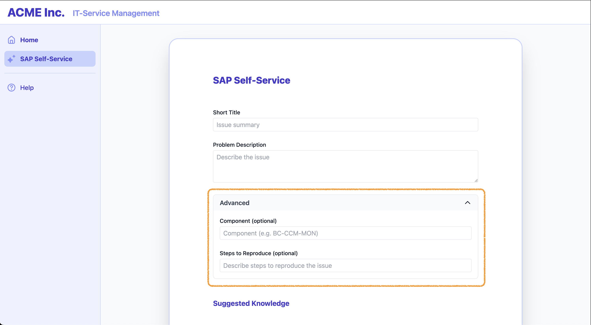
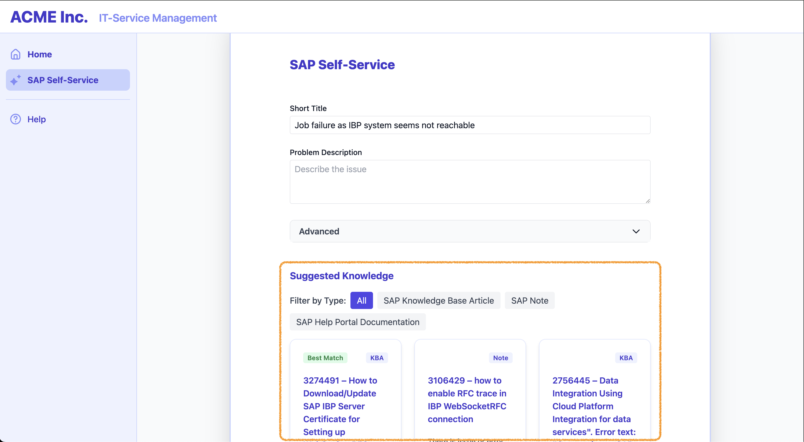

# Exercise 03 - Optimize the use of SAP knowledge recommendations <!-- omit in toc -->

_Estimated Time: **15 min**_

In this exercise, you'll level up the basic recommendations by introducing optional power‑user inputs and filtering so SAP knowledge can be tuned to specific business needs.

## Table of Contents <!-- omit in toc -->

- [Experiment with additional query parameters](#experiment-with-additional-query-parameters)
- [Filter the recommendations based on specific business needs](#filter-the-recommendations-based-on-specific-business-needs)
- [Summary](#summary)
- [Further reading](#further-reading)

## Experiment with additional query parameters

Besides the minimal required input parameters implemented in [Exercise 02](../ex2/README.md), the Solution Recommendation API additionally exposes *optional* fields to further specify the query and provide tailored SAP knowledge for instance to power-users.

The below modifications will lead to a user interface that looks like this:



:point_right: Enhance the application by allowing users to optionally supply an **SAP software component** and **detailed steps to reproduce** related to the occurring problem.

- Introduce an advanced section in `src/components/DetailsForm.jsx` to collect the users' input for the two new optional fields. Insert the code below the previously added form fields at the place marked by `{/* EXERCISE 03 - ADD ADVANCED SECTION HERE */}`.
```javascript
{/* EXERCISE 03 - ADD ADVANCED SECTION HERE */}
{/* Advanced Section */}
<div className="border rounded-lg mt-6">
  <button
    type="button"
    className="w-full flex justify-between items-center px-4 py-2 bg-gray-50 hover:bg-gray-100 rounded-t-lg focus:outline-none"
    onClick={() => setShowAdvanced((v) => !v)}
    aria-expanded={showAdvanced}
    aria-controls="advanced-section"
  >
    <span className="font-semibold text-gray-700">Advanced</span>
    <svg className={`h-5 w-5 transform transition-transform ${showAdvanced ? 'rotate-180' : ''}`} fill="none" stroke="currentColor" viewBox="0 0 24 24"><path strokeLinecap="round" strokeLinejoin="round" strokeWidth="2" d="M19 9l-7 7-7-7" /></svg>
  </button>
  {showAdvanced && (
    <div id="advanced-section" className="px-4 py-4 space-y-6">
      <FormField label="Component (optional)">
        <input
          value={form.component || ''}
          onChange={e => setForm({ ...form, component: e.target.value })}
          onBlur={handleFieldBlur}
          className="w-full border rounded px-2 py-1"
          placeholder="Component (e.g. BC-CCM-MON)"
          aria-required="false"
        />
      </FormField>
      <FormField label="Steps to Reproduce (optional)">
        <input
          value={form.stepsToReproduce || ''}
          onChange={e => setForm({ ...form, stepsToReproduce: e.target.value })}
          onBlur={handleFieldBlur}
          className="w-full border rounded px-2 py-1"
          placeholder="Describe steps to reproduce the issue"
          aria-required="false"
        />
      </FormField>
    </div>
  )}
</div>
```

- Adapt the `handleFieldBlur()` function in `src/components/DetailsForm.jsx` to forward the field values to the API call.
```javascript
function handleFieldBlur() {
  // Only search if either field has changed since last search
  if (
    form.subject === lastSearch.subject &&
    form.description === lastSearch.description &&
    form.component === lastSearch.component &&
    form.stepsToReproduce === lastSearch.stepsToReproduce
  ) {
    return;
  }

  ...

  // Perform search
  searchSolutions(form.subject, form.description, form.component, form.stepsToReproduce)
    .then(data => setSuggestions(data.items || []))
    .catch(e => console.error(e))
    .finally(() => {
      setLoadingSug(false);
      setLastSearch({
        subject: form.subject,
        description: form.description,
        component: form.component,
        stepsToReproduce: form.stepsToReproduce
      });
    });
}
```

- Finally, call the Solution Recommendation API in `src/api/index.js` with the two additional input parameters. Add the `component` and `stepsToReproduce` to the *function signature* and *payload variable*.
```javascript
export async function searchSolutions(subject, description, component, stepsToReproduce) {
  const payload = { subject, description, component, stepsToReproduce };
  ...
}
```

:point_right: Test the new changes and observe their effect on the recommendations.

> [!TIP]
> To start with you can try the following example problem.
> 
> Observe how the relevant knowledge document is ranked higher once the component is being provided.
> <details>
> <summary>📝  Example 1</summary>
> </br>
> 
> - **Subject:** While upgrading BW on HANA system to BW/4HANA got error in SUM phase extraction
> - **Description:** During the upgrade from BW on HANA to BW/4HANA, we’re encountering an error in the SUM extraction phase. Error Message: Connection to HDB could not be established. Please check the connection and the entered parameters.
> - **Component:** HAN-DB-CLI
> 
> :bulb: **Relevant knowledge document**: 3610362
> </details>

## Filter the recommendations based on specific business needs

The Solution Recommendation API provides for each suggested SAP knowledge document various metadata fields, which can be leveraged to filter the documents based on specific business needs.

By the end of this step, your interface with the filter feature will look like this:



#### Filter by Document Type  <!-- omit in toc -->
The currently available SAP knowledge document types are:
- `kba`: SAP Knowledge Base Articles (KBA)
- `note`: SAP Notes
- `help`: SAP Help Portal Documentation
- `community`: SAP Community content

:point_right: Implement the filtering logic for the incoming suggestions in `src/components/DetailsForm.jsx` inside the respective functions `getAvailableDocumentTypes()` and `filterSuggestions()`.
```javascript
// Filtering logic
function getAvailableDocumentTypes() {
  // Collect the document types present in the incoming suggestions
  return Array.from(new Set(suggestions.map(s => s.type && s.type.toLowerCase()).filter(Boolean)));
}
function filterSuggestions() {
  // Filter the retrieved suggestions based on the selected document types
  if (typeFilter.length === 0){
    return suggestions;
  } else {
    return suggestions.filter(s => s.type && typeFilter.includes(s.type.toLowerCase()));
  }
}
```

:point_right: Implement the filtering UI in `src/components/TypeFilter.jsx` by rendering a button for each document type available in the incoming suggestions. Add the code where indicated by `{/*  EXERCISE 03 - ADD TYPE FILTER UI HERE */}`.
```javascript
{/*  EXERCISE 03 - ADD TYPE FILTER UI HERE */}
<span className="font-medium text-gray-700">Filter by Type:</span>
<button
    type="button"
    className={`px-3 py-1 rounded ${typeFilter.length === 0 ? 'bg-indigo-600 text-white' : 'bg-gray-100 text-gray-700'}`}
    onClick={() => setTypeFilter([])}
>All</button>
{availableTypes.map(type => (
    <button
        key={type}
        type="button"
        className={`px-3 py-1 rounded ${typeFilter.includes(type) ? 'bg-indigo-600 text-white' : 'bg-gray-100 text-gray-700'}`}
        onClick={() => setTypeFilter(typeFilter.includes(type)
            ? typeFilter.filter(t => t !== type)
            : [...typeFilter, type])}
    >
        {typeDisplayMap[type] || (type.charAt(0).toUpperCase() + type.slice(1))}
    </button>
))}
```

:point_right: To enable the new filtering functionality make the following changes in `src/components/DetailsForm.jsx`.
- Add the `TypeFilter` UI element within the `<div id="cards-section">` where indicated by `{/* EXERCISE 03 - LOAD TYPE FILTER ELEMENT HERE */}`. 
- Set the `Suggestions` UI element to use the filtered suggestions by replacing `solutions={suggestions}` with `solutions={filterSuggestions()}`.

The final code section should now look like this:
```javascript
<div id="cards-section">
  {/* EXERCISE 03 - LOAD TYPE FILTER ELEMENT HERE */}
  <TypeFilter
    availableTypes={getAvailableDocumentTypes()}
    typeFilter={typeFilter}
    setTypeFilter={setTypeFilter}
    typeDisplayMap={typeDisplayMap}
  />
  <Suggestions solutions={filterSuggestions()} loading={loadingSug} />
</div>
```

:point_right: Refresh the ITSM demo application page to test your changes. After providing the search parameters, you can filter the suggested documents by their type.

> [!TIP]
> You can use the following example to explore the filtering capability for various document types.
> <details>
> <summary>📝  Example 1</summary>
> </br>
> 
> - **Subject:** in posting TR document in after HRSP upgrade
> - **Description:** Error caused after HRSP upgrade that went live on 08th June 2024. Travel documents are not getting posted to accounting. Error in postings. Error message KI145 Activate Business processes in controlling area 9000 in 2024.
> 
> </details>

## Summary
In this exercise you transformed a generic recommendation feed into a controllable, context-aware assist layer:

- Added optional advanced inputs (component, steps to reproduce) to sharpen semantic relevance for power users without burdening casual users.
- Introduced dynamic client-side filtering by document type (Notes, KBAs, Help, Community) so users can align results with process preferences.
- Established a refinement loop (edit then blur to refresh) that encourages iterative probing instead of one-shot queries.

As a result, ACME's ITSM app now supports both quick self-service for general users and targeted exploration for experts who know which dimensions matter.

## Further reading

---

[Next exercise](../ex4/README.md)