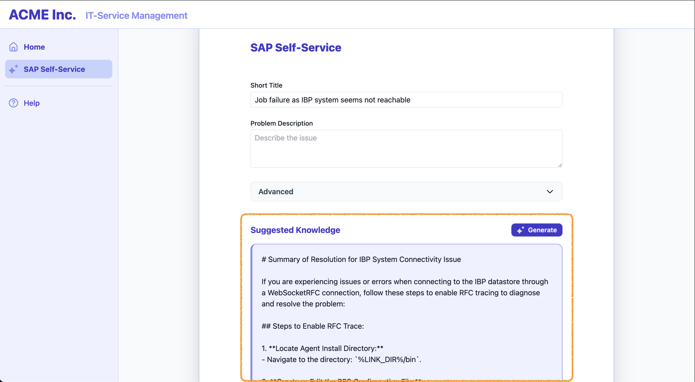

# Exercise 04 — Generate actionable SAP knowledge summaries with Generative AI <!-- omit in toc -->

_Estimated Time: **20 min**_

In this exercise, you integrate the Answer Generation API to turn a problem description into a streamed, concise resolution summary with cited SAP sources. You'll inspect the API in a notebook, then wire a lightweight UI flow that streams answer text, shows source attribution, and lets users toggle back to the underlying documents.

## Table of Contents <!-- omit in toc -->

- [API at a glance](#api-at-a-glance)
- [Call the Answer Generation API from Jupyter notebook](#call-the-answer-generation-api-from-jupyter-notebook)
- [Wire the frontend call to Answer Generation API](#wire-the-frontend-call-to-answer-generation-api)
- [Render the generated answer in the UI](#render-the-generated-answer-in-the-ui)
- [Summary](#summary)
- [Further reading](#further-reading)

## API at a glance

> [!NOTE]
> The Answer Generation self-service API is currently in beta phase.

- **Endpoint:** `/http/supportcases/recommendations/solutions/rag`
- **Method:** `POST`
- **Request Headers:**
```http
Content-Type: application/json
Accept: text/event-stream
```
- **Request body:**
```
{
  "reporter": Reporter of the issue (S-User),
  "subject"*: Subject of the issue (short description),
  "description"*: Description of the issue (long description),
  "component": Application component of the incident
}
```
- **Response as Server-Sent Events (SSE) stream:**
```
event: "message"
retry: 15000
data: "partial text chunk"
time: 1759823535.7548084

event: "source"
retry: 15000
data: [
  {
    "display_name": Knowledge document ID,
    "title": Knowledge document title,
    "url": Knowledge document URL
  }
]
```

## Call the Answer Generation API from Jupyter notebook

:point_right: Head over to your SAP Business Application Studio Dev Space and open the Python Jupyter notebook at `exercises/ex4/assets/ex4_api_exploration.ipynb`.

:point_right: After running the cells to install and import the required libraries, provide values for the `subject`, `description` and optionally `component` input parameters and run the cells to perform the request to the Answer Generation API.

> [!TIP]
> Experiment with your own input parameters or use the example below to test the Answer Generation API.
>
> <details>
> <summary>📝  Example 1</summary>
> </br>
> 
> - **Subject:** API for form launch
> - **Description:** In SuccessFactors system, we wanted to autolaunch the PM forms using CPI. So, just wanted to check if it is possible to autolaunch the form using CPI. If yes, kindly share the api for the same.
> - **Component:** LOD-DF-INT-CON
> - **Additional information:** Got error 403 when creating a form using OData API function import and seems we do not have permission to create performance review form for subject id. Got 500 error when launching forms via OData API.
> </details>
>
> For further examples refer to those mentioned in [Exercise 01](/exercises/ex1/README.md#try-out-the-solution-recommendation-api) and [Exercise 03](/exercises/ex3/README.md#filter-the-recommendations-based-on-specific-business-needs).

## Wire the frontend call to Answer Generation API

:point_right: Start by implementing the HTTP request to the Answer Generation API in `src/api/index.js`.

- Define the API endpoint to be called.
```javascript
const ANSWER_GENERATION_ENDPOINT = `/${API_BASE}/http/supportcases/recommendations/solutions/rag`;
```

- Complete the implementation of the `generateAnswer()` function to perform an Event Source request and parse the incoming events' data. Define the *function signature*, *payload variable* and `onmessage()` function.
```javascript
export async function generateAnswer({ subject, description, component, onData, onError, onComplete }) {
  const payload = { subject, description, component };
  ...
      onmessage(event) {
        // Parse the event type and the event data
        if (onData && event.data) {
          onData(JSON.parse(event.event), JSON.parse(event.data));
        }
      },
  ...
}
```

:point_right: In `DetailsForm.jsx`, implement the logic within the `handleStreamAPI()` function to enable calling the Answer Generation API from the UI.
```javascript
  async function handleStreamAPI() {
    setCardsCollapsed(true);
    setStreamedAnswer("");
    setLoadingStream(true);
    setSourceTags([]);
    setShowAnswer(true);

    // Only call service if subject or description is provided
    if (form.subject.length < 1 && form.description.length < 3) {
      setStreamedAnswer("Please provide a title or description to generate an answer.");
      setLoadingStream(false);
      return;
    }

    // Perform the streaming call
    await generateAnswer({
      subject: form.subject,
      description: form.description,
      component: form.component,
      onData: (type, chunk) => {
        // Process incoming event
        // Concatenate together the message-type events to form the answer text.
        if (type === "message") {
          setStreamedAnswer(prev => prev + chunk);
        }

        // Collect the sources from the source-type event
        if (type === "source" && Array.isArray(chunk)) {
          setSourceTags(chunk);
        }
      },
      onError: (err) => {
        setStreamedAnswer("Unable to generate an answer currently. Please try again later.");
        setLoadingStream(false);
      }
    });
    setLoadingStream(false);
  }
```

## Render the generated answer in the UI

Now, let’s build the part of the UI that shows the generated answer. The final result will look like this:



:point_right: Implement a button within the "Suggested Knowledge" section in `src/components/DetailsForm.jsx` to trigger the Answer Generation API and retrieve an answer for the given problem description.
```javascript
{/* EXERCISE 04 - ADD GENEREATE BUTTON HERE */}
<button
  type="button"
  className="flex items-center gap-2 px-3 py-1 rounded-lg bg-indigo-700 text-white hover:bg-indigo-800 shadow transition text-sm"
  onClick={handleStreamAPI}
  disabled={loadingStream}
>
  <svg className="w-4 h-4 text-indigo-100" viewBox="0 0 96.21 96.21" fill="currentColor" xmlns="http://www.w3.org/2000/svg">
    <path d="M62.96 58.78c4.17 1.4 4.17 7.35 0 8.76C48.62 72.38 42.25 78.76 37.4 93.09c-1.41 4.16-7.31 4.16-8.72 0C23.83 78.76 17.46 72.38 3.12 67.54c-4.17-1.4-4.17-7.35 0-8.76 14.34-4.84 20.71-11.22 25.56-25.55 1.41-4.16 7.31-4.16 8.72 0 4.85 14.33 11.22 20.71 25.56 25.55ZM94.5 20.44c2.27-.76 2.27-4.01 0-4.78-7.82-2.64-11.3-6.12-13.95-13.95-.77-2.27-3.99-2.27-4.76 0-2.64 7.82-6.12 11.3-13.95 13.95-2.27.76-2.27 4.01 0 4.78 7.82 2.64 11.3 6.12 13.95 13.95.77 2.27 3.99 2.27 4.76 0 2.64-7.82 6.12-11.3 13.95-13.95Z" />
  </svg>
  <span className="font-semibold">Generate</span>
</button>
```

:point_right: We already implemented the UI component in `src/components/GeneratedAnswer.jsx` that displays the generated answer. Take a look at it to understand how it is implemented.

:point_right: Go back to `src/components/DetailsForm.jsx` and add the `GeneratedAnswer` component where marked by `{/* EXERCISE 04 - ADD ANSWER DISPLAY HERE */}` in the lower section of the file.

This will display the answer text once the "Generate" button is clicked.
```javascript
{/* EXERCISE 04 - ADD ANSWER DISPLAY HERE */}
{showAnswer && (
  <GeneratedAnswer
    loading={loadingStream}
    answer={streamedAnswer}
    sources={sourceTags}
  />
)}
```
:point_right: In addition to the generated answer, we want to keep displaying the SAP knowledge documents retrieved by the Solution Recommendation API. To keep the UI organized, the documents will be placed within a collapsible area.

- Start by adding a collapsible area below the generated answer element as indicated by `{/* EXERCISE 04 - ADD COLLAPSIBLE AREA HERE */}`.
```javascript
{/* EXERCISE 04 - ADD COLLAPSIBLE AREA HERE */}
{/* Collapsible document cards & filters area */}
<div className="mt-6">
  {showAnswer && (
    <button
      type="button"
      className="flex items-center gap-1 px-2 py-1 rounded bg-transparent text-gray-500 hover:bg-gray-100 hover:text-indigo-600 mb-2 transition"
      onClick={() => setCardsCollapsed(v => !v)}
      aria-expanded={!cardsCollapsed}
      aria-controls="cards-section"
    >
      <svg className={`w-4 h-4 transform transition-transform ${cardsCollapsed ? '' : 'rotate-180'}`} fill="none" stroke="currentColor" viewBox="0 0 24 24"><path strokeLinecap="round" strokeLinejoin="round" strokeWidth="2" d="M19 9l-7 7-7-7" /></svg>
      <span className="text-sm">{cardsCollapsed ? 'Show' : 'Hide'} Knowledge Documents & Filters</span>
    </button>
  )}
</div>
```

- Set the `className` of `<div id="cards-section">` to be hidden when the area is collapsed.
```javascript
<div id="cards-section" className={cardsCollapsed ? 'hidden' : ''}>
  <TypeFilter
    availableTypes={getAvailableDocumentTypes()}
    typeFilter={typeFilter}
    setTypeFilter={setTypeFilter}
    typeDisplayMap={typeDisplayMap}
  />
  <Suggestions solutions={filterSuggestions()} loading={loadingSug} />
</div>
```

- Finally, move the entire `div id="cards-section"` containing the knowledge documents and the filters inside the previously created collapsible area.

The resulting code section should look like this:
```javascript
{/* EXERCISE 04 - ADD COLLAPSIBLE AREA HERE */}
{/* Collapsible document cards & filters area */}
<div className="mt-6">
  {showAnswer && (
    <button
      type="button"
      className="flex items-center gap-1 px-2 py-1 rounded bg-transparent text-gray-500 hover:bg-gray-100 hover:text-indigo-600 mb-2 transition"
      onClick={() => setCardsCollapsed(v => !v)}
      aria-expanded={!cardsCollapsed}
      aria-controls="cards-section"
    >
      <svg className={`w-4 h-4 transform transition-transform ${cardsCollapsed ? '' : 'rotate-180'}`} fill="none" stroke="currentColor" viewBox="0 0 24 24"><path strokeLinecap="round" strokeLinejoin="round" strokeWidth="2" d="M19 9l-7 7-7-7" /></svg>
      <span className="text-sm">{cardsCollapsed ? 'Show' : 'Hide'} Knowledge Documents & Filters</span>
    </button>
  )}
  <div id="cards-section" className={cardsCollapsed ? 'hidden' : ''}>
    <TypeFilter
      availableTypes={getAvailableDocumentTypes()}
      typeFilter={typeFilter}
      setTypeFilter={setTypeFilter}
      typeDisplayMap={typeDisplayMap}
    />
    <Suggestions solutions={filterSuggestions()} loading={loadingSug} />
  </div>
</div>
```

:point_right: Test the generative functionality in the ITSM demo application by providing the problem details and clicking on the **Generate** button.

> [!TIP]
> Experiment with your own input parameters or use the example [above](#call-the-answer-generation-api-from-jupyter-notebook).

## Summary

In this exercise you evolved from presenting raw recommendation lists to delivering an actionable synthesized answer:

- Explored the Answer Generation API contract and its server-sent event stream in a notebook.
- Implemented a frontend streaming call that assembles incremental message chunks into a readable answer.
- Collected and displayed cited SAP knowledge sources alongside the generated guidance.

## Further reading
